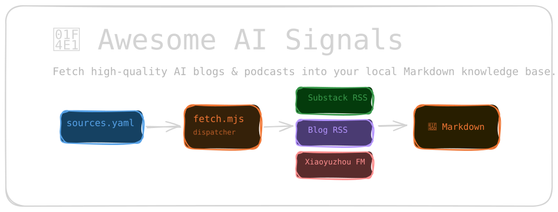
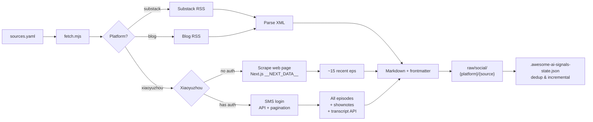

# Awesome AI Signals

[](https://awesome.re)
[](https://www.npmjs.com/package/awesome-ai-signals)

> **Signal, not noise.** A curated list of 9 hand-picked AI thought leaders — blogs, newsletters, and podcasts that consistently deliver high-signal content.
>
> Comes with a CLI to sync everything to your local Markdown knowledge base.

A community-curated [Awesome List](https://awesome.re) of AI content sources worth following. Each entry is chosen because the author **consistently** produces original, high-signal work — not just news aggregation.

---

## Contents

- [The List](#the-list)
  - [Substack](#substack)
  - [Independent Blogs](#independent-blogs)
  - [Xiaoyuzhou FM (小宇宙)](#xiaoyuzhou-fm-小宇宙)
- [Bundled CLI](#bundled-cli)
  - [Installation](#installation)
  - [Usage](#usage)
  - [How It Works](#how-it-works)
  - [Output](#output)
- [Adding Sources](#adding-sources)
- [Contributing](#contributing)

---

## The List

> 9 hand-picked AI thought leaders across 3 platforms. See [`curated/`](curated/) for machine-readable YAML lists.

### Substack

| Source | Description |
|--------|-------------|
| [Fei-Fei Li](https://drfeifei.substack.com) | Spatial intelligence, world models, computer vision |
| [Sebastian Raschka](https://sebastianraschka.substack.com) | Ahead of AI: LLM engineering, coding agents, paper reviews |
| [Andrej Karpathy](https://karpathy.substack.com) | Former Tesla/OpenAI AI lead. Infrequent but essential. |
| [Demis Hassabis](https://demishassabis.substack.com) | CEO of Google DeepMind. AGI, AlphaFold, RL. |
| [Zara Zhang](https://zarazhang.substack.com) | AI investing, China-US tech, learning |

### Independent Blogs

| Source | Description |
|--------|-------------|
| [Lilian Weng](https://lilianweng.github.io) | Former OpenAI safety VP. RL, agents, LLMs, scaling laws. |
| [Dwarkesh Patel](https://www.dwarkesh.com) | In-depth interviews with AI pioneers and scientists |

### Xiaoyuzhou FM (小宇宙)

| Source | Description |
|--------|-------------|
| 张小珺Jùn｜商业访谈录 | 2-7 hour deep interviews: AI, self-driving, robotics, chips |
| 十字路口Crossing | Koji's podcast: AI × business, agents, coding, startups |

---

## Bundled CLI



The repository ships with a CLI tool that reads this list and fetches posts/episodes into local Markdown files — ready for LLM ingest, offline reading, or personal knowledge base.

Supports **Substack**, **RSS/Atom blogs**, and **Xiaoyuzhou FM podcasts** (with official word-for-word transcripts, not local Whisper).

### Installation

```bash
# npm (global CLI)
npm install -g awesome-ai-signals

# Or install as an AI Agent Skill
npx skills add royce17/awesome-ai-signals

# Or clone manually
git clone https://github.com/royce17/awesome-ai-signals.git
cd awesome-ai-signals && npm install
```

Works with **Bun** and **Node.js 22+**.

### Usage

```bash
cp sources.example.yaml sources.yaml   # Edit your source list
awesome-ai-signals                     # Fetch all sources

# Or with Bun
bun run scripts/fetch.mjs

# Preview only
awesome-ai-signals --dry

# Single platform or source
awesome-ai-signals --platform substack
awesome-ai-signals --source "Fei-Fei Li"
```

Xiaoyuzhou podcasts require a one-time SMS login (for full history and transcripts):
```bash
bun run scripts/login-xiaoyuzhou.mjs
```

For sources behind GFW (Substack, etc.), set your proxy:
```bash
export HTTPS_PROXY=http://127.0.0.1:your-port
```

### How It Works



### Output

```
raw/social/
├── substack/
│   └── drfeifei/
│       └── 2025-11-10-from-words-to-worlds.md
├── blog/
│   └── lilianweng.github.io/
│       └── 2026-07-04-harness.md
└── xiaoyuzhou/
    └── 张小珺Jùn｜商业访谈录/
        └── 2026-07-22-147-robotics-foundation-model.md
```

Each file is a Markdown document with full YAML frontmatter. Xiaoyuzhou episodes include **description + timeline + transcript** (via the official transcript API — no GPU, instant delivery).

---

## Adding Sources

**Recommended: use the curated lists** in `curated/` to get started fast. Just uncomment the sources you want.

```bash
ls curated/
# substack.yaml    — AI/LLM, AI Infra, AI Safety
# blogs.yaml       — Independent blogs (Lilian Weng, Dwarkesh)
# xiaoyuzhou.yaml  — AI deep interviews, AI industry, AI startups
```

Uncomment and copy to `sources.yaml`, or edit `sources.yaml` directly:

```yaml
sources:
  # Substack
  - name: "Fei-Fei Li"
    substack: "drfeifei"

  - name: "Sebastian Raschka"
    substack: "sebastianraschka"

  # Independent blogs (any RSS/Atom feed)
  - name: "Lilian Weng"
    blog: "https://lilianweng.github.io/index.xml"

  - name: "Dwarkesh Patel"
    blog: "https://www.dwarkesh.com/feed.xml"

  # Xiaoyuzhou podcasts (copy PID from podcast page URL)
  - name: "张小珺｜商业访谈录"
    xiaoyuzhou: "626b46ea9cbbf0451cf5a962"
```

### Platform Fields

| Field | Format | Example |
|-------|--------|---------|
| `substack` | Subdomain | `drfeifei` → `drfeifei.substack.com` |
| `blog` | Full RSS/Atom URL | `https://example.com/feed.xml` |
| `xiaoyuzhou` | Podcast PID | String after `podcast/` in the URL |

---

## Contributing

This is a **community-curated** Awesome List. Know a great AI blog, newsletter, or podcast that consistently delivers original, high-signal content?

[Open an issue](https://github.com/Royce17/awesome-ai-signals/issues) or send a PR with the source added to the appropriate `curated/*.yaml` file.

Ground rules:
- The source must have a track record of **original** thinking — not just news or link roundups
- One source per line, commented out, with a brief description of who they are
- Substack entries use the subdomain only; Xiaoyuzhou entries use the podcast PID

---

## License

MIT
