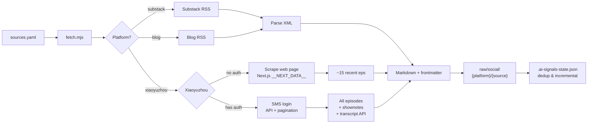

# AI-Signals

**Signal, not noise.** Curated AI blogs & podcasts into your local Markdown knowledge base.

Supports **Substack**, **independent blog RSS feeds**, and **Xiaoyuzhou FM podcasts** (with official word-for-word transcripts, not local Whisper).

## Installation

```bash
# Install as an AI Agent Skill (recommended)
npx skills add royce17/ai-signals

# Or clone manually
git clone https://github.com/royce17/ai-signals.git
cd ai-signals && npm install
```

Works with **Bun** and **Node.js 22+**.

## Quick Start

```bash
cp sources.example.yaml sources.yaml   # Edit your source list
bun run scripts/fetch.mjs              # Fetch all sources
```

Xiaoyuzhou podcasts require a one-time login (for full history and transcripts):
```bash
bun run scripts/login-xiaoyuzhou.mjs   # SMS login, takes 30 seconds
```

For sources behind GFW (Substack, etc.), set your proxy:
```bash
export HTTPS_PROXY=http://127.0.0.1:your-port
```

## How It Works



## Adding Sources

**Recommended: use the curated lists** in `curated/` to get started fast. Just uncomment the sources you want.

```bash
ls curated/
# substack.yaml    — AI/LLM, AI Infra, AI Safety
# blogs.yaml       — Independent blogs (Lilian Weng, Dwarkesh)
# xiaoyuzhou.yaml  — AI deep interviews, AI industry, AI startups
```

Uncomment and copy to `sources.yaml`, or edit `sources.yaml` directly:

```yaml
sources:
  # Substack
  - name: "Fei-Fei Li"
    substack: "drfeifei"

  - name: "Sebastian Raschka"
    substack: "sebastianraschka"

  # Independent blogs (any RSS/Atom feed)
  - name: "Lilian Weng"
    blog: "https://lilianweng.github.io/index.xml"

  - name: "Dwarkesh Patel"
    blog: "https://www.dwarkesh.com/feed.xml"

  # Xiaoyuzhou podcasts (copy PID from podcast page URL)
  - name: "张小珺｜商业访谈录"
    xiaoyuzhou: "626b46ea9cbbf0451cf5a962"
```

### Platform Fields

| Field | Format | Example |
|-------|--------|---------|
| `substack` | Subdomain | `drfeifei` → `drfeifei.substack.com` |
| `blog` | Full RSS/Atom URL | `https://example.com/feed.xml` |
| `xiaoyuzhou` | Podcast PID | String after `podcast/` in the URL |

## Output

```
raw/social/
├── substack/
│   └── drfeifei/
│       └── 2025-11-10-from-words-to-worlds.md
├── blog/
│   └── lilianweng.github.io/
│       └── 2026-07-04-harness.md
└── xiaoyuzhou/
    └── 张小珺Jùn｜商业访谈录/
        └── 2026-07-22-147-robotics-foundation-model.md
```

Each file is a Markdown document with full YAML frontmatter. Xiaoyuzhou episodes include **description + timeline + transcript** (via the official transcript API — no GPU, instant delivery).

## Features

- 🔌 **Multi-platform** — One YAML config for Substack, RSS blogs, and Xiaoyuzhou
- 🎙️ **Official transcripts** — The only tool using Xiaoyuzhou's transcript API (zero GPU)
- 🔐 **SMS login** — Built-in guided login for Xiaoyuzhou, token auto-refresh
- 🌐 **Proxy support** — `HTTPS_PROXY` for users behind GFW
- 📥 **Incremental fetch** — Deduplication built-in, only pulls new content
- 📝 **Markdown output** — Clean frontmatter, ready for LLM ingest

## AI Agent Integration

When installed as a skill, AI agents auto-detect it. You can also say:

> "Fetch all the sources in my sources.yaml"

## License

MIT

---

**Community-curated.** Know a great AI podcast or Substack that belongs here? [Open an issue](https://github.com/Royce17/ai-signals/issues) to recommend it.
