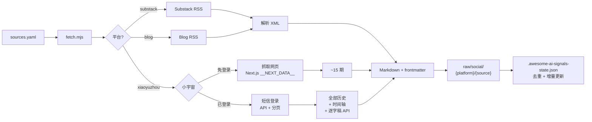

# 📡 Awesome AI Signals

[](https://awesome.re)
[](https://www.npmjs.com/package/awesome-ai-signals)

> **Signal, not noise.** 一份精选 AI 信息源列表：9 位持续产出高质量内容的 AI 思想领袖 — 博客、Newsletter、播客。附带一个 CLI 工具，一键同步到本地 Markdown 知识库。

一个社区共建的 [Awesome List](https://awesome.re)，收录值得长期追踪的 AI 内容源。每个入选者都基于其**持续产出原创思考**的能力，而非简单搬运新闻。

---

## 目录

- [精选列表](#精选列表)
  - [Substack](#substack)
  - [独立博客](#独立博客)
  - [小宇宙 FM](#小宇宙-fm)
- [附带的 CLI 工具](#附带的-cli-工具)
  - [安装](#安装)
  - [使用](#使用)
  - [工作原理](#工作原理)
  - [输出格式](#输出格式)
- [添加信息源](#添加信息源)
- [参与贡献](#参与贡献)

---

## 精选列表

> 9 位精选 AI 思想领袖，覆盖 3 大平台。机器可读的 YAML 列表见 [`curated/`](curated/)。

### Substack

| 来源 | 简介 |
|------|------|
| [Fei-Fei Li](https://drfeifei.substack.com) | 空间智能、世界模型、计算机视觉 |
| [Sebastian Raschka](https://sebastianraschka.substack.com) | Ahead of AI：LLM 工程、编程 Agent、论文解读 |
| [Andrej Karpathy](https://karpathy.substack.com) | 前 Tesla/OpenAI AI 负责人，低频但必读 |
| [Demis Hassabis](https://demishassabis.substack.com) | Google DeepMind CEO，AGI、AlphaFold、强化学习 |
| [Zara Zhang](https://zarazhang.substack.com) | AI 投资、中美科技、学习方法 |

### 独立博客

| 来源 | 简介 |
|------|------|
| [Lilian Weng](https://lilianweng.github.io) | 前 OpenAI 安全 VP，RL、Agent、LLM、Scaling Laws |
| [Dwarkesh Patel](https://www.dwarkesh.com) | 与 AI 先驱和科学家的深度访谈 |

### 小宇宙 FM

| 来源 | 简介 |
|------|------|
| 张小珺Jùn｜商业访谈录 | 2-7 小时深度访谈：AI、自动驾驶、机器人、芯片 |
| 十字路口Crossing | Koji 的播客：AI × 商业、Agent、编程、创投 |

---

## 附带的 CLI 工具


仓库自带 CLI，读完列表一键抓取博文和播客到本地 Markdown——可喂给 LLM、离线阅读、或搭建个人知识库。

支持 **Substack**、**RSS/Atom 博客**、**小宇宙播客**（含官方逐字稿，非本地 Whisper）。

### 安装

```bash
# npm 全局安装
npm install -g awesome-ai-signals

# 作为 AI Agent Skill 安装
npx skills add royce17/awesome-ai-signals

# 或手动克隆
git clone https://github.com/royce17/awesome-ai-signals.git
cd awesome-ai-signals && npm install
```

支持 **Bun** 和 **Node.js 22+**。

### 使用

```bash
cp sources.example.yaml sources.yaml   # 编辑你的信息源
awesome-ai-signals                     # 抓取所有源

# 或用 Bun
bun run scripts/fetch.mjs

# 预览模式
awesome-ai-signals --dry

# 按平台或源筛选
awesome-ai-signals --platform substack
awesome-ai-signals --source "Fei-Fei Li"
```

小宇宙播客需要登录一次（获取逐字稿和全量历史）：
```bash
bun run scripts/login-xiaoyuzhou.mjs   # 短信验证码登录，30 秒搞定
```

海外源需要代理：
```bash
export HTTPS_PROXY=http://127.0.0.1:your-port
```

### 工作原理



### 输出格式

```
raw/social/
├── substack/
│   └── drfeifei/
│       └── 2025-11-10-from-words-to-worlds.md
├── blog/
│   └── lilianweng.github.io/
│       └── 2026-07-04-harness.md
└── xiaoyuzhou/
    └── 张小珺Jùn｜商业访谈录/
        └── 2026-07-22-147. 和蚂蚁灵波沈宇军聊....md
```

每篇 Markdown 带完整 YAML frontmatter。小宇宙播客包含 **简介 + 时间轴 + 逐字稿**（使用官方 transcript API，非本地 Whisper 转录，零 GPU 消耗，秒级获取）。

---

## 添加信息源

**推荐用精选列表快速开始：** `curated/` 目录下有按主题分类的推荐源，取消注释即可启用。

```bash
ls curated/
# substack.yaml    — AI/LLM、AI Infra、AI 安全等
# blogs.yaml       — 独立博客（Lilian Weng、Dwarkesh 等）
# xiaoyuzhou.yaml  — AI 深度访谈、AI 产业、AI 创投等
```

将想要追踪的源取消注释，复制到 `sources.yaml`。也可以直接编辑 `sources.yaml`：

```yaml
sources:
  # Substack 博客
  - name: "李飞飞"
    substack: "drfeifei"

  - name: "Sebastian Raschka"
    substack: "sebastianraschka"

  # 独立博客（任意 RSS/Atom feed）
  - name: "Lilian Weng"
    blog: "https://lilianweng.github.io/index.xml"

  - name: "Dwarkesh Patel"
    blog: "https://www.dwarkesh.com/feed.xml"

  # 小宇宙播客（从播客主页 URL 中复制 PID）
  - name: "张小珺｜商业访谈录"
    xiaoyuzhou: "626b46ea9cbbf0451cf5a962"

  - name: "十字路口Crossing"
    xiaoyuzhou: "60502e253c92d4f62c2a9577"
```

### 平台字段说明

| 字段 | 格式 | 示例 |
|------|------|------|
| `substack` | Substack 子域名 | `drfeifei` → `drfeifei.substack.com` |
| `blog` | 完整 RSS/Atom URL | `https://example.com/feed.xml` |
| `xiaoyuzhou` | 小宇宙播客 PID | URL 中 `podcast/` 后面的字符串 |

---

## 参与贡献

这是一个**社区共建**的 Awesome List。你知道有哪位 AI 博主、Newsletter 作者或播客持续产出原创、高质量内容？

[提 Issue](https://github.com/Royce17/awesome-ai-signals/issues) 或直接发 PR，把信息源加到对应的 `curated/*.yaml` 中。

收录原则：
- 必须有持续产出**原创思考**的记录——不只是新闻聚合或链接整理
- 每条一行，默认注释，附一句话说明这个人是谁
- Substack 只写子域名；小宇宙只写播客 PID

---

## License

MIT
