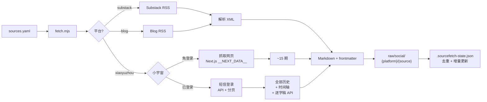

# SourceFetch

一键抓取 AI 领域高质量信息源的博客和播客，存入本地 Markdown 知识库。

支持 **Substack**、**独立博客 RSS**、**小宇宙播客**（含官方逐字稿）。

## 安装

```bash
# 作为 AI Agent Skill 安装（推荐）
npx skills add royce17/sourcefetch

# 或手动克隆
git clone https://github.com/royce17/sourcefetch.git
cd sourcefetch && npm install
```

支持 **Bun** 和 **Node.js 22+**。

## 快速开始

```bash
cp sources.example.yaml sources.yaml   # 编辑你的信息源
bun run scripts/fetch.mjs              # 抓取所有源
```

小宇宙播客需要登录一次（获取逐字稿和全量历史）：
```bash
bun run scripts/login-xiaoyuzhou.mjs   # 短信验证码登录，30 秒搞定
```

海外源需要代理：
```bash
export HTTPS_PROXY=http://127.0.0.1:your-port
```

## 工作原理



## 添加信息源

**推荐用精选列表快速开始：** `curated/` 目录下有按主题分类的推荐源，取消注释即可启用。

```bash
ls curated/
# substack.yaml    — AI/LLM、AI Infra、AI 安全等
# blogs.yaml       — 独立博客（Lilian Weng、Dwarkesh 等）
# xiaoyuzhou.yaml  — AI 深度访谈、AI 产业、AI 创投等
```

将想要追踪的源取消注释，复制到 `sources.yaml`。也可以直接编辑 `sources.yaml`：

```yaml
sources:
  # Substack 博客
  - name: "李飞飞"
    substack: "drfeifei"

  - name: "Sebastian Raschka"
    substack: "sebastianraschka"

  # 独立博客（任意 RSS/Atom feed）
  - name: "Lilian Weng"
    blog: "https://lilianweng.github.io/index.xml"

  - name: "Dwarkesh Patel"
    blog: "https://www.dwarkesh.com/feed.xml"

  # 小宇宙播客（从播客主页 URL 中复制 PID）
  - name: "张小珺｜商业访谈录"
    xiaoyuzhou: "626b46ea9cbbf0451cf5a962"

  - name: "十字路口Crossing"
    xiaoyuzhou: "60502e253c92d4f62c2a9577"
```

### 平台字段说明

| 字段 | 格式 | 示例 |
|------|------|------|
| `substack` | Substack 子域名 | `drfeifei` → `drfeifei.substack.com` |
| `blog` | 完整 RSS/Atom URL | `https://example.com/feed.xml` |
| `xiaoyuzhou` | 小宇宙播客 PID | URL 中 `podcast/` 后面的字符串 |

## 输出格式

```
raw/social/
├── substack/
│   └── drfeifei/
│       └── 2025-11-10-from-words-to-worlds.md
├── blog/
│   └── lilianweng.github.io/
│       └── 2026-07-04-harness.md
└── xiaoyuzhou/
    └── 张小珺Jùn｜商业访谈录/
        └── 2026-07-22-147. 和蚂蚁灵波沈宇军聊....md
```

每篇 Markdown 带完整 YAML frontmatter。小宇宙播客包含 **简介 + 时间轴 + 逐字稿**（使用官方 transcript API，非本地 Whisper 转录，零 GPU 消耗，秒级获取）。

## 特性

- 🔌 **多平台统一** — 一个 YAML 管理 Substack、博客 RSS、小宇宙播客
- 🎙️ **小宇宙官方逐字稿** — 唯一使用官方 transcript API 的工具，无需 GPU
- 🔐 **小宇宙短信登录** — 内置引导，一次配置长期有效（token 自动刷新）
- 🌐 **代理支持** — `HTTPS_PROXY` 环境变量，国内用户友好
- 📥 **增量抓取** — 自动去重，只拉新内容
- 📝 **Markdown 输出** — 带 frontmatter，可直接喂给 LLM

## 与 AI Agent 配合

作为 skill 安装后，Agent 自动识别。你也可以直接说：

> "帮我把 sources.yaml 里的所有源抓取一遍"

## License

MIT

---

**社区共建。** 你觉得有值得收录的 AI 播客或 Substack？[提 Issue](https://github.com/Royce17/sourcefetch/issues) 推荐它。
